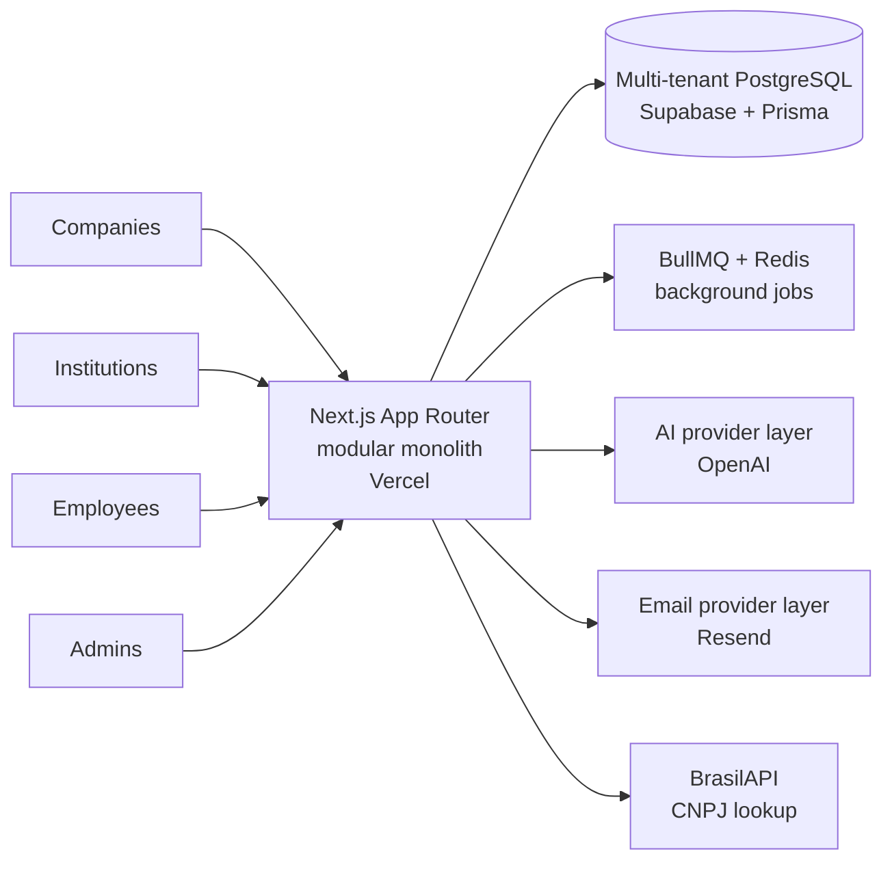

<h1>Connecta+</h1>

  <b>A B2B education marketplace that connects Brazilian companies to universities and specialized institutions for employee development.</b>

&nbsp;

> **Note:** the source code is private. This repository is a public overview of the product and the engineering behind it. I'm happy to walk through the code in an interview.

## How it works

Three sides on one platform:

- **Companies** onboard their employees, set eligibility rules and define learning tracks.
- **Institutions** manage their own course catalog.
- **Employees** get a competency diagnosis, a personal development plan and course recommendations, then request enrollment.

The platform orchestrates recommendations, approvals, payments and progress tracking without owning the content.

## My role

Sole engineer. I built the whole product: architecture, database, back end, front end, deploy and AI features. Product direction and visual design came from the Connecta+ team.

## What I built

- Public sign-up with live company lookup by CNPJ (Brazil's company registry number) through BrasilAPI.
- Admin panel that drives the platform's state machines, with a full audit trail.
- Self-service catalog for institutions.
- Company panel with employee invites, CSV import and eligibility policies.
- Employee panel with competency diagnosis, development plan generation with adherence scoring, a course marketplace, tracks and enrollment requests.
- AI observability panel with usage telemetry, cost estimation and useful or not useful feedback on AI outputs.

## Architecture

## Engineering highlights

- **Modular monolith** on a multi-tenant PostgreSQL database, keeping each domain isolated without the overhead of microservices.
- **State machines at the core:** employee enablement, educational offerings and enrollment requests each follow an explicit state machine.
- **Audit integrity in the database:** audit records are written by PostgreSQL triggers, so no application path can skip them.
- **Provider abstractions** for email and AI, which let the project switch vendors (Brevo to Resend, Anthropic to OpenAI) with no structural rework.
- **Test suite:** 300+ unit tests and about 40 end-to-end tests with Playwright.

## Tech stack

Next.js (App Router) · TypeScript · Node.js · Prisma · PostgreSQL · Redis · BullMQ · Zod · Tailwind CSS · shadcn/ui · OpenAI · Resend · Playwright · Vercel · Supabase

## Screenshots

  
  

